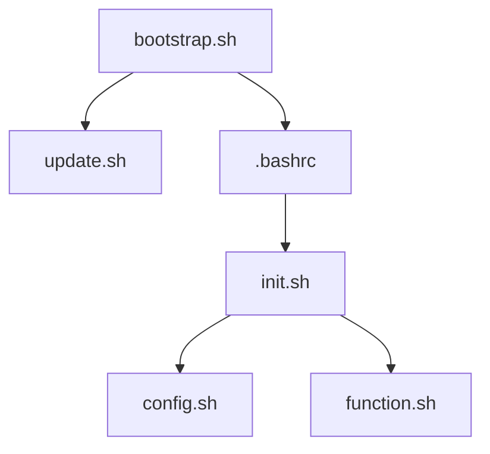

# 服务器初始化配置

这是一个模块化的服务器初始化配置系统，用于在新服务器上快速配置开发环境。

## 目录结构

```bash
setup/
├── bootstrap.sh
├── update.sh
├── init.sh
├── config.sh
├── function.sh
└── README.md
```

## 脚本关系图



## 核心脚本及功能

### bootstrap.sh（引导脚本）

- 系统配置的入口脚本
- 主要功能：
  - 设置 SSH 配置和权限
  - 克隆配置仓库
  - 运行 update.sh 进行初始化部署
  - 在 .bashrc 中添加必要的配置

### update.sh（环境部署脚本）

- 一次性执行的系统级配置部署工具
- 主要功能：
  - 创建必要的目录结构（~/.local/bin, ~/.local/etc 等）
  - 复制配置文件到正确位置
  - 解压和安装工具包
  - 部署整个用户环境

### init.sh（初始化脚本）

- shell 环境的主要初始化脚本
- 主要功能：
  - 防止重复加载
  - 设置 PATH 环境变量
  - 加载其他配置脚本（config.sh, function.sh）
  - 清理重复的 PATH 条目

### config.sh（会话配置脚本）

- 运行时的 shell 会话环境配置
- 主要功能：
  - 设置常用别名（ls, ll, la, grep等）
  - 配置环境变量（PATH等）
  - 设置开发环境（Java, Maven等）

### function.sh（函数脚本）

- 定义实用函数
- 主要功能：
  - 设置历史记录大小
  - 提供文件解压缩函数（q-extract）
  - 提供文件压缩函数（q-compress）
  - 提供 ANSI 颜色显示函数（q-ansicolors）
  - 提供代理开关函数（proxy_on, proxy_off）
  - 其他实用函数

## 执行流程

本节对代码执行流程进行说明，如果只关心使用方法，可以跳至[使用方法](#使用方法)。

1. 初始化阶段：
   - 执行 `bootstrap.sh`：设置基本环境
   - `bootstrap.sh` 调用 `update.sh` 进行系统部署
   - 配置 .bashrc 加载初始化脚本

2. 日常使用阶段（每次打开新的 shell）：
   - `.bashrc` 加载 `init.sh`
   - `init.sh` 依次加载配置脚本：
     - `config.sh`：设置 shell 会话环境
     - `function.sh`：加载实用函数

## 使用方法

1. 克隆仓库到本地
2. 运行 `bootstrap.sh` 进行初始化配置
3. 重新登录以使配置生效
